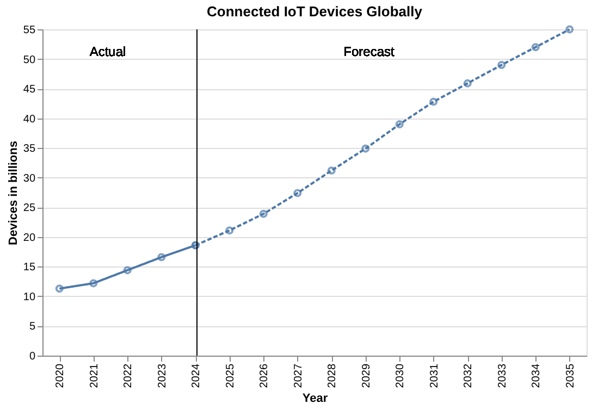
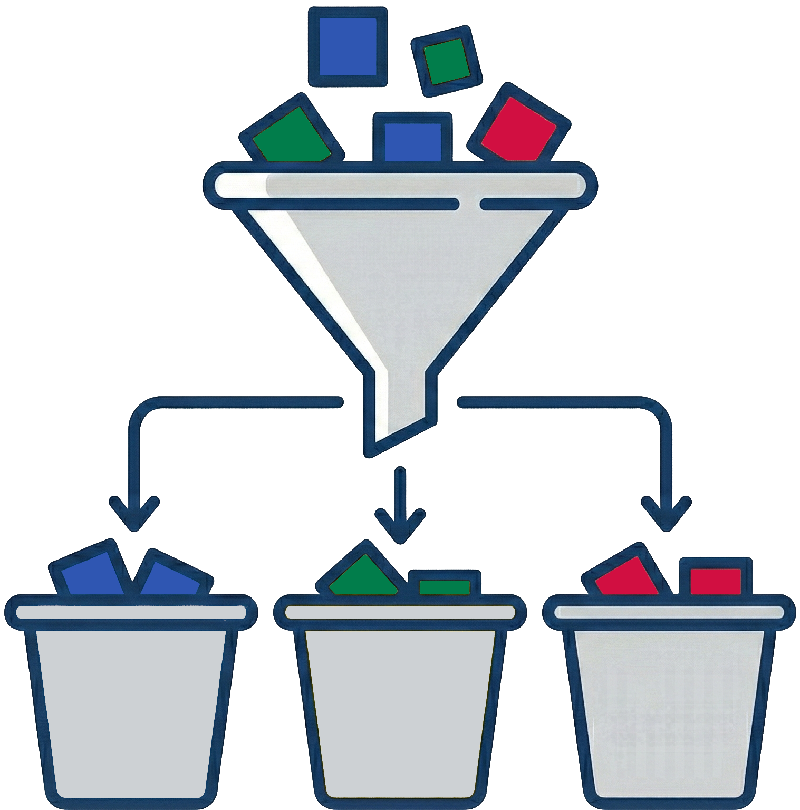

# Motivation

::left::

- 55 billion devices by **2035**

Deployment Domains: 

    
<material-symbols-watch-screentime />Wearables

    
<material-symbols-house />Smart Home

    
<material-symbols-health-metrics />Health Care

    
<material-symbols-factory />Manufacturing

    
<material-symbols-agriculture /> Agriculture

    
...

**Consequence**: Application complexity grows

::right::

    

Data from: IoT Analytics (Oct. 2025). State of IoT 2025. en-US. URL: https://iot-analytics.com/number-connected-iot-devices/ (visited on 01/05/2026).

<!--
limited resources 10kb to few hundred RAM;  
this trend increases the application complexity.
-->

---
hideInToc: true
layout: full
---

    

        <h3> <strong>Virtualization</strong> as an emerging paradigm for constrained devices </h3>
    

    

        <strong>Potential Benefits: </strong>
        <ul class="m-b-4"> 
            <li>Memory Isolation</li>
            <li>Application Portability </li>
            <li>Usage of High-Level Programming Languages </li>
        </ul>
        
Variety of different Solutions 

        
Deployments: 

        

            
 <material-symbols-watch-screentime />FitBit LLC
 
            
 <material-symbols-watch-screentime />Garmin LTD

            
 <material-symbols-house /> Moddable Tech Inc
 
            
 <material-symbols-house />Tizen Project

        

        

            
 <material-symbols-search /> Lack of comprehensive Evaluations

        

    

<!--
**Benefits:** increase security + Ease development process
 **Memory Isolation:** Important for constrained devices, because they lack hardware enforced isolation.
  **RIOT OS** supports six solutions,
 **Lack of Evaluations** ... hard for developers to make a **informed** data-drive decision, which virtualization to pick.
-->

---
hide: false
---

## Research Goals

    
Classify virtualization approaches

    
Find relevant comparison metrics

    
Identify trade-offs

<v-click>

<strong>Method:</strong>

    
 1. Qualitative Feature Comparison 

    

        <material-symbols-keyboard-arrow-right class="text-4xl"/>
    

    
 2. Empirical Evaluation on RIOT OS 

</v-click>

<!--
**metrics** => basis for the decision of the developer
 **trade-off** that each virtualization technology makes
 
  I want to reach these goals by first: 
 **Qualitative** comparison on the provided **capabilities** of a broad set of virtualization technologies.
 **Empirical:** Quantify the Performance Overhead
 
 **End:** Before I come to, that I am going to provide some **context** about virtualization **in general**
-->
