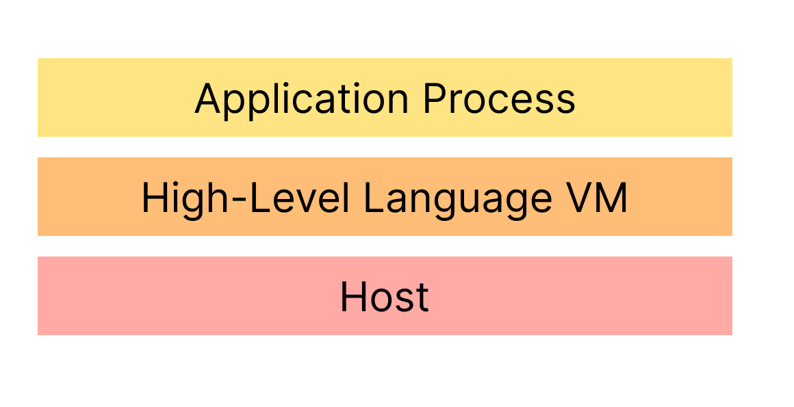

# What is Virtualization?

::left::
**Definition** by Popek and Goldberg (1974):
- virtual Guest and real Host  
- Map Guest state and operation to Host

**Taxonomy** by J. E. Smith and Nair (2005)

    
Same ISA

    
vs.

    
Different ISA

    
System VM

    
vs.

    
Process VM

::right::

    

<!-- **ISA:** memory model + instruction (e.g. add, sub, ...) | **Same** => more efficient, but hardware isolation mechanism -->

---
clicks: 5
---

## Virtualization Taxonomy

    

    
Same ISA

    
Different ISA

    
System VM

    
 1}" src="../assets/classic-system-vm.png" />

    
 2}"src="../assets/whole-system-vm.png" />

    
Process VM

    
 3}" src="../assets/os-level-container.png"/>

    

    <Spotlight
        :active-clicks="[1,2,3,4]"
        :x="[20.5,65.2,20.5,65.2]"
        :y="[13,9.5,60,66.5]"
        :w="[24.5,24.5,24.5,24.5]"
        :h="[37,44.5,30.5,22]"
    />

