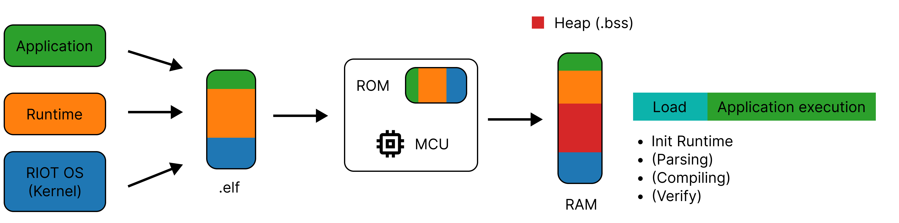
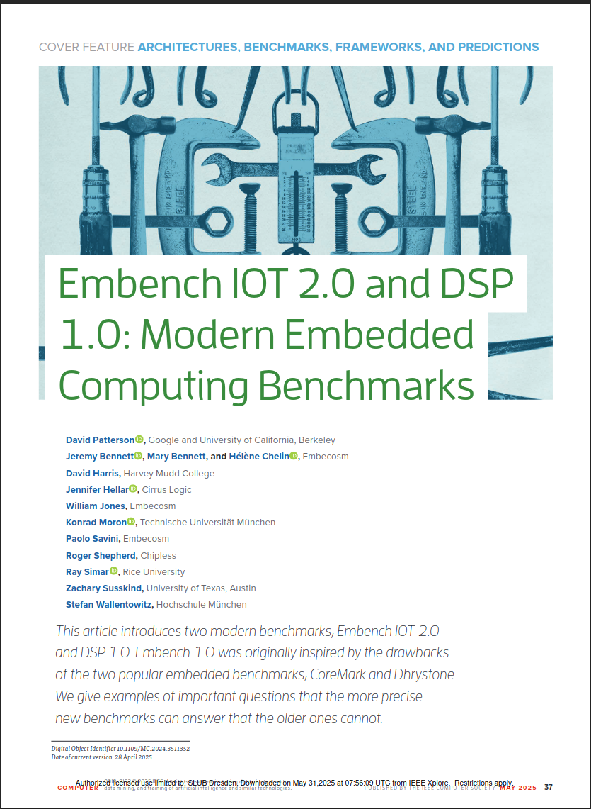

    

        <h1> Empirical Evaluation on RIOT OS</h1>
    

    

        <ol>
            <li>Candidate Introduction </li>
            <li>Classification </li>
            <li>HLL VM Architecture </li>
            <li>Benchmark 
                <ol>
                    <li>Design</li>
                    <li>Implementation</li>
                    <li>Results</li>
                </ol>
            </li>
        </ol>
    

<!--**Design:** Metrics + Benchmark Programms-->

<!--
**classify** into two groups
  present basic architecture shared by **all** => basis to understand the (nature of the) overhead
 

---

## Candidates

    
<logos-javascript />JerryScript 

    
<logos-python />Micropython

    
<logos-lua />Lua

    
Femto-Container

    
µBPF

    
<logos-webassembly /><strong>W</strong>eb<strong>A</strong>ssembly <strong>M</strong>icro <strong>R</strong>untime (WAMR)

<!--
**Start:** All candidates are HLL VMs 
 **first row** are dynamic script languages, **input** to the engine is **text-based** script code
  JerryScript and Micropython ==> specifically designed for low-resource devices
 Lua => lightweight language by design  

 **second row** all execute a form of pre-compiled bytecode
  **Femto and µBPF** => research projects, ebpf, introduced in **Linux Kernel**, lightweight VM, 11 registers, 512-byte stack, **no heap**
  WAMR => executes WebAssembly, compilation target for the browser, uses as **general-purpose** compilation target, with runtimes targeting different environments including constrained devices. **Two Modes** (evaluated separatly)

**End:** These six candidates **divided** into two categories
-->

---
clicks: 4
---

## Candidates Classification

<table style="position: relative">
    <Spotlight 
        :active-clicks="[1,2,3]" 
        :x="[23.5, 62.5, 82.5]" 
        :y="[11, 11, 11]" 
        :w="[39, 10.5, 7]" 
        :h="[89, 89, 89]" 
    />
    <thead>
        <tr style="border-bottom: 0px">
            <th />
            <th />
            <th colspan="3" style="text-align: center">Architectural Properties</th> 
            <th colspan="4" style="text-align: center">Feature Counts</th>
        </tr>
        <tr>
            <th />
            <th>HLL VM</th>
            <th>Garbage Collection</th>
            <th>Typing</th>
            <th>Bytecode Compilation</th>
            <th class="text-center">Development</th>
            <th class="text-center">Operation</th>
            <th class="text-center">Security</th>
            <th class="text-center">Compilation</th>
        </tr>
    </thead>
    <tbody>
        <tr class="dynamic">
            <td rowspan="3" class="border-right">Dynamic VMs</td>
            <td>JerryScript</td>
            <td>Yes</td>
            <td>Dynamic</td>
            <td>On-device</td>
            <td class="text-center"><strong>4/5</strong></td>
            <td class="text-center"><strong>1/3</strong></td>
            <td class="text-center"><strong>1/6</strong></td>
            <td class="text-center"><strong>0/2</strong></td>
        </tr>
        <tr class="dynamic">
            <td>MicroPython</td>
            <td>Yes</td>
            <td>Dynamic</td>
            <td>On-Device</td>
            <td class="text-center"><strong>4/5</strong></td>
            <td class="text-center"><strong>1/3</strong></td>
            <td class="text-center"><strong>0/6</strong></td>
            <td class="text-center"><strong>0/2</strong></td>
        </tr>
        <tr class="dynamic">
            <td>Lua</td>
            <td>Yes</td>
            <td>Dynamic</td>
            <td>On-Device</td>
            <td class="text-center"><strong>4/5</strong></td>
            <td class="text-center"><strong>1/3</strong></td>
            <td class="text-center"><strong>3/6</strong></td>
            <td class="text-center"><strong>0/2</strong></td>
        </tr>
        <tr class="static">
            <td rowspan=4 class="border-right">Static VMs</td>
            <td>WAMR</td>
            <td>No</td>
            <td>Static</td>
            <td>Off-Device</td>
            <td class="text-center"><strong>3/5</strong></td>
            <td class="text-center"><strong>2/3</strong></td>
            <td class="text-center"><strong>4/6</strong></td>
            <td class="text-center"><strong>1/2</strong></td>
        </tr>
        <tr class="static">
            <td>WAMR (fast)</td>
            <td>No</td>
            <td>Static</td>
            <td>Off-Device</td>
            <td class="text-center"><strong>3/5</strong></td>
            <td class="text-center"><strong>2/3</strong></td>
            <td class="text-center"><strong>4/6</strong></td>
            <td class="text-center"><strong>1/2</strong></td>
        </tr>
        <tr class="static">
            <td>Femto-Container</td>
            <td>No</td>
            <td>Static</td>
            <td>Off-Device</td>
            <td class="text-center"><strong>1/5</strong></td>
            <td class="text-center"><strong>1/3</strong></td>
            <td class="text-center"><strong>4/6</strong></td>
            <td class="text-center"><strong>0/2</strong></td>
        </tr>
        <tr class="static">
            <td>&mu;BPF</td>
            <td>No</td>
            <td>Static</td>
            <td>Off-Device</td>
            <td class="text-center"><strong>1/5</strong></td>
            <td class="text-center"><strong>2/3</strong></td>
            <td class="text-center"><strong>4/6</strong></td>
            <td class="text-center"><strong>1/2</strong></td>
        </tr>
    </tbody>
</table>

<!--
**Start:** This table shows this **Categorization**
  first column are the HLLVMs
  then the architecutral properties, that are the reason for this classification
  Feature-Counts from previous evaluation per feature category

  **dynamic** => runtime object carry metadata information
  source code compiled to **bytecode** 

**End:** All share the same **fundamental structure**
-->

---

## Fundamental HLL VM Architecture

    

<!--
**Start:** Bytecode Interpreter
  execute bytecode instruction (opcode -> number; operands)
  **processed** in 3 step **pipeline**
  One of the main reason for overhead, executed for **every** instruction; for **native** programms done in hardware

 **End:** To measure the **exect** overhead => conducted **Benchmark**
-->

---
layout: full
---

    

        <h2>Benchmark</h2>
    

    

        <ol>
            <li><strong>Design</strong>
                <ol>
                    <li>Metrics</li>
                    <li>Benchmark Programms</li>
                </ol>
            </li>
            <li><strong>Measurement Implementation</strong></li>
            <li><strong>Results</strong>
                <ol>
                    <li>Load Time</li>
                    <li>Execution Time</li>
                    <li>Code Size</li>
                    <li>ROM footprint</li>
                    <li>RAM usage</li>
                </ol>
            </li>
        </ol>
    

<!--
**Start:** ....

 Detail for each metric the results
-->

---

## Design: Metrics

    

        

            <strong>Compilation</strong>
            <material-symbols-code />Code Size
        

    

    

        <material-symbols-keyboard-arrow-right class="text-4xl"/>
    

    

        

            <strong>Flash on Device</strong>
            <material-symbols-memory/>ROM footprint
        

    

    

        <material-symbols-keyboard-arrow-right class="text-4xl"/>
    

    

        

            <strong>Execution</strong>
            
<material-symbols-memory/>RAM usage

            
<material-symbols-timer/>Load Time

            
<material-symbols-timer/>Execution Time

        

    

<!--
**Start:** To find relevant criteria: look at simple **Deployment Pipeline** (steps necessary to get the application to the device)
  first produce a runable application artifact => how efficient is the **application encoded**
  flash to device => footprint of the whole firmware image. 
  then **Execution** RAM usage, measure runtime overhead in **2** metrics. How long does it take until the **first instruction** of the application is executed. 
  **Execution** => how long to complete the workload.    

 **End:** ... which brings me to the benchmark programs.
-->

---
layout: two-cols-header
---

## Design: Benchmark Programms

::left::
Subset of Embench IoT 2.0 

*Static Memory*
- xgboost
- crc_32
- ud

*Dynamic Memory*
- md5sum
- tarfind

::right::

    

<!--
**Start:** Designed to represent a set of benchmarks written in C, that represent common IoT Workloads. 
  Each Programm is **modified** to run on the virtual machine.
  Femto-Container and µBPF do **not** offer a **heap** region for dynamic memory allocations.
-->

---
layout: two-cols-header
---

## Implementation

::left::

Implemented Measurements on top of **RIOT OS**

- **Code Size**: file size of the executable
- **Flash footprint**: cosy 
- **RAM Usage**: cosy + `malloc_monitor`
- **Load Time + Execution Time**: ztimer

Average of **5** Executions.

::right::

**Hardware:** Adafruit Feather nRF52840 Sense
- CPU: ARM Cortex M4F (64 MHz)
- 1 MB flash
- 256 KB SRAM

<!--
**Start:** All of the Virtual Machines run on top of RIOT OS. **Common Baseline** 
  => enables a fair comparison
-->
