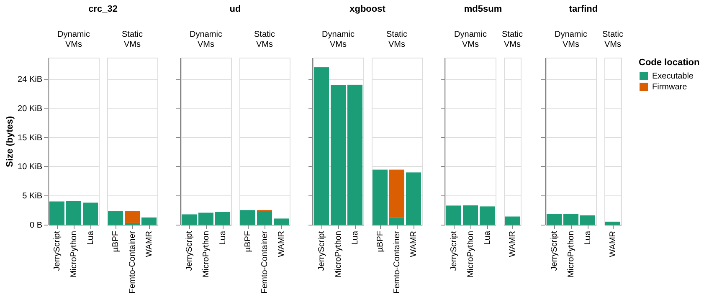
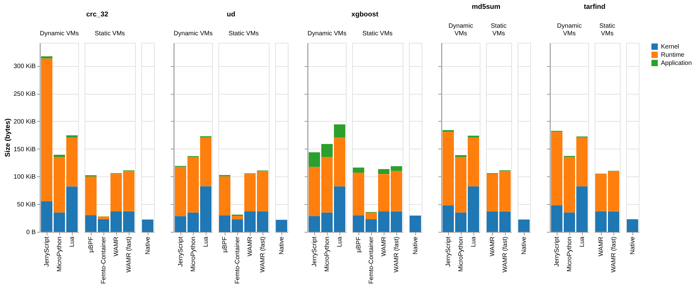
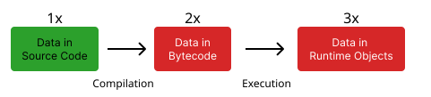
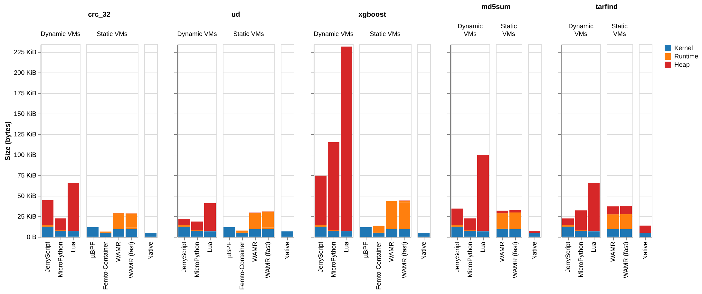
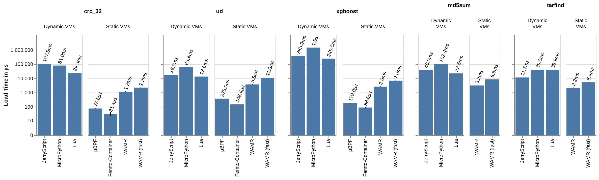
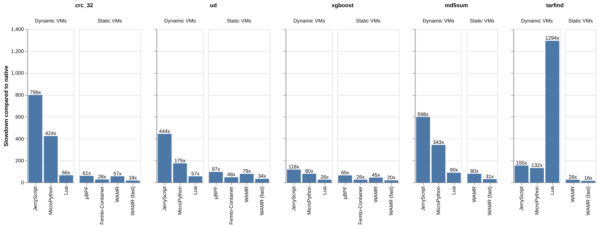

## Results: Code Size

<TwoColAnimated :active="$clicks >= 1">
    <template #left>
    
        <strong>Key Insights</strong>
        <ul>
            <li>Bytecode encoding more efficient than text based</li>
            <li>`0x77073096` 4 bytes as 32-bit int vs. 10 bytes in ASCII</li>
        </ul>
    
    </template>
    <template #right>
        
    </template>
</TwoColAnimated>

<!--
**y-axis:** size in bytes  |  **x-axis**: each VM, grouped by type and benchmark.  
constant from the crc_32 benchmark
-->

---
clicks: 3
---

## Results: Flash footprint

<TwoColAnimated :active="$clicks >= 1">
    <template #left>
        
            <strong>Key Insights</strong>
            <ul>
               <li>Dynamic VMs occupy more space</li> 
               <li>femto container ~40 Kib lowest footprint</li>
            </ul>
        
    </template>
    <template #right>
        <Spotlight 
            :active-clicks="[2]" 
            :x="[34]" 
            :y="[70]" 
            :w="[1.8]" 
            :h="[25]" 
        />
        
    </template>
</TwoColAnimated>

<!--**Dynamic VMs** include compiler, garbage collection + type handling logic | **femto container** => minimal implementation without data relocations-->

---

## Results: RAM usage

    

<TwoColAnimated :active="$clicks >= 1">
    <template #left>
        
            <strong>Key Insights</strong>
            <ul>
                <li>Dynamic VMs incur highest RAM (data duplication)</li>
                <li>Lua has overall highest footprint</li>
            </ul>
        
    </template>
    <template #right>
        
    </template>
</TwoColAnimated>

<!--
**WAMR**: moderate RAM usage => runtime structures occupy more space  
Why is µBPF only blue? all allocations are done on the system stack / this could only be assigned one label. It is not precise.
-->

---
clicks: 3
---

## Results: Load Time

<TwoColAnimated :active="$clicks >= 1">
  <template #left>
     
        <strong>Key Insights</strong>
        <ul>
            <li>Load Time of dynamic VMs <strong>orders of magnitude</strong> higher</li>
            <li><strong>Reason:</strong> Bytecode compilation overhead</li>
            <li>WAMR (fast) longest load time of <strong>static VMs</strong></li>
        </ul>
    
  </template>

  <template #right>
    <Spotlight 
        :active-clicks="[2]" 
        :x="[48]" 
        :y="[9]" 
        :w="[19]" 
        :h="[84]" 
    />
    
  </template>

</TwoColAnimated>

---
clicks: 4
---

## Results: Execution Time

<TwoColAnimated :active="$clicks >= 1">
    <template #left>
        
            <strong>Key Insights</strong>
            <ul>
                <li>HLL VMs impose significant slowdown (16x at best)</li>
                <li>WAMR (fast) most efficient (24x avg)</li>
                <li>Dynamic VMs are slower than static VMs</li>
                <li>Lua is the fastest of the dynamic VMs (~60x), except for string operations</li>
            </ul>
        
    </template>
    <template #right>
        <Spotlight 
            :active-clicks="[2,3]" 
            :x="[84,94.7]" 
            :y="[5,70]" 
            :w="[13.5,2.5]" 
            :h="[86, 20]" 
        />
        
    </template>
</TwoColAnimated>
