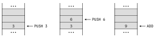
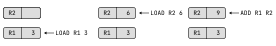
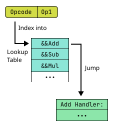
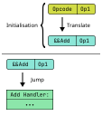

## Execution Model

<div class="flex flex-col gap-4 mt-4">
    <strong>Stack based</strong>
    
    <strong>Register based</strong>
    
</div>

---

## Dispatch Mechanism

<div class="mt-4 grid grid-cols-3 gap-12 relative">
<div> 

**Switch Case Dispatch**

<div class="my-16" />

```c
switch(opcode) {
    case ADD: 
        push(op1 + op2);
    ...
}
```
</div> 

<div>

**Indirect Threaded Dispatch**



</div>

<div>

**Direct Threaded Dispatch**



</div>

</div>

<style>
strong {
    margin-bottom: 20px;
}
</style>
